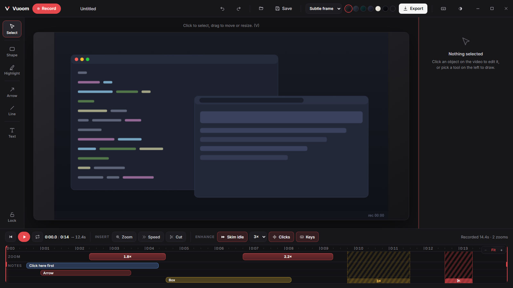
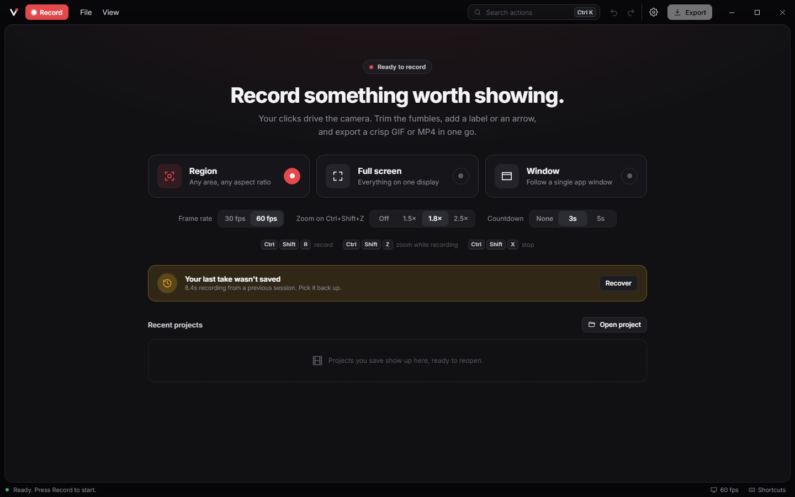
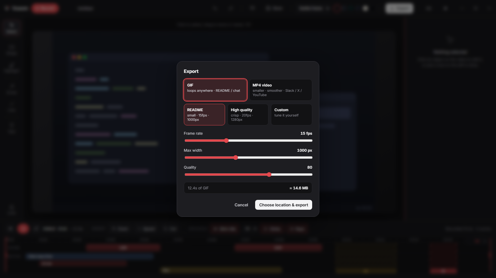
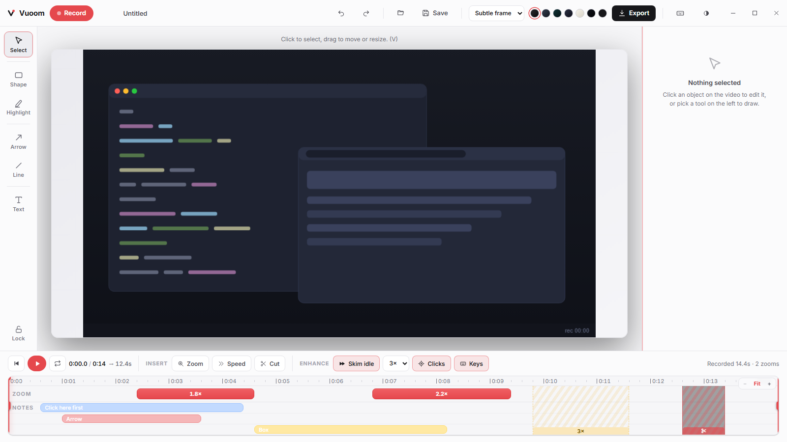

<div align="center">


# Vuoom

**Screen recordings that zoom where it matters.**

A **free, open-source screen recorder for Windows** with cinematic **auto-zoom**.
Record your screen, the camera glides into the action, and you export a small,
crisp **demo GIF or MP4** ready for your GitHub README, changelog, Slack, or
product post. No account, no watermark, no subscription.

**[Website](https://razee4315.github.io/Vuoom/)** · **[Download](https://razee4315.github.io/Vuoom/download/)** · **[Guide](https://razee4315.github.io/Vuoom/guide/)**

[](https://github.com/Razee4315/Vuoom/releases/latest)
[](https://github.com/Razee4315/Vuoom/releases)
[](https://github.com/Razee4315/Vuoom/actions/workflows/ci.yml)
[](./LICENSE)




</div>

---

## Why Vuoom?

A flat recording of your whole screen makes UI text tiny and the "wow" moment
invisible. The tools that fix this, the ones that smoothly zoom into each click
like a little camera operator (Screen Studio and friends), are **Mac-only, paid,
or both**. Vuoom is that experience as a free Screen Studio alternative for
Windows, in a small native app:

**Record, zoom happens where you point, cut the dead air, export a GIF or MP4
you can paste anywhere.**

## A studio, not a toolbar

The interface is a quiet workspace built from floating panels you control:

- **Every panel is yours to arrange.** Show or hide the tool rail, inspector and
  timeline (`Ctrl+1/2/3`), drag the inspector and timeline to any size, collapse
  the timeline to its transport bar, slim the tool rail to icons. Double click a
  divider to reset it, `Ctrl+0` resets everything. Layout is remembered.
- **An inspector that follows you.** Select something and its every property is
  there in collapsible sections; select nothing and the **Clip** tab holds the
  whole-recording settings: frame and backdrop, crop, auto zooms, pacing, click
  ripples and keystrokes.
- **Search every action** with `Ctrl+K`, right-click anything for its menu, and
  hover any control to see its shortcut.
- **Home that starts the right take**: Region, Full screen or Window, with frame
  rate, zoom strength, audio and countdown set right there.

| | |
|---|---|
|  |  |
| **Home that starts the right take.** Region, full screen or window, with frame rate, zoom and countdown on the page; recovery and recents below. | **Framing first.** One glass HUD over the frozen desktop: aspect presets, zoom, fps and countdown next to a single Record button. |
|  |  |
| **Export without a wizard.** Format cards, presets, sliders, an honest size estimate and a fit-under-N-MB helper, then copy or reveal. | **Five themes, re-tuned.** Black and white first, plus Graphite, Paper and Midnight. No purple anywhere. |

## Features

- 🎥 **Native capture**: Windows Graphics Capture at full resolution: a region
  (free or 16:9 / 9:16 / 1:1 / 4:5), a whole display, or a single app window,
  on any monitor, with pause/resume. Capture is paced at the compositor to the
  frame rate you pick (24 / 30 / 60 fps), so a 144 Hz screen doesn't burn CPU on
  frames nobody needs.
- 🖱️ **A smooth pointer**: record without the real cursor and Vuoom draws a
  clean one from your movements, gliding (jitter smoothed out with no lag),
  pressing on every click, sized so it stays legible in a small GIF,
  scaling with the zoom like the real thing, and (if you like) fading away
  while it rests, back just before it moves.
- 🎙️ **Narration and system sound**: record your microphone, everything the
  computer plays, or both, each as its own track with a live level meter while
  you frame the shot. Audio is timed by the same clock as the frames, so it
  stays in sync through every cut and speed-up; sped-up stretches play silent.
  Waveforms sit on the timeline, with volume and mute per track, and MP4
  exports carry an AAC soundtrack.
- 🎥 **You, in the corner**: record your webcam alongside the screen and it
  appears as a bubble you can move to any corner, resize, reshape (circle,
  rounded square, 16:9) and mirror after the fact. The record HUD previews it
  live, right where it will sit.
- 🧹 **Studio-clean narration**: one switch removes fan noise, hum and hiss
  (RNNoise), another evens out a voice that drifts toward and away from the
  mic, with peaks held safely under clipping. Both work on a copy, so the
  original recording is always one click away.
- 💬 **Captions, made offline**: one click turns your narration into captions,
  on your own computer (whisper.cpp; the speech model downloads once, nothing is
  uploaded). They show in the preview and in every GIF and MP4, bottom or top, at
  the size you pick; fix any word in the inspector, drag a caption's bar to
  retime it, and save an `.srt` file timed to your export for YouTube and other
  players.
- 🗜️ **Recordings that stay small**: frames are stored losslessly as LZ4
  compressed XOR deltas with periodic keyframes, typically 20x+ smaller than raw
  pixels, streamed to disk as you record so length is bounded by your drive and
  a crash never loses the take.
- 🔍 **Cinematic zoom**: press `Ctrl+Shift+Z` while recording to glide the camera
  into your cursor (and again to pull back out). Critically damped spring motion,
  never a hard cut. In the editor every zoom is aimable (follow the cursor or lock
  a crosshair), has a feel (Smooth / Snappy / Slow), and **Auto zooms** can
  re-plan them from your clicks at any strength. Every zoom and pan carries a
  touch of motion blur, like a camera shutter, so even a 30 fps GIF glides.
- 🎞️ **A real editor, not a video NLE**: timeline with named, colour-coded tracks,
  magnetic snapping, trim handles (or `I` / `O`), cuts, speed-ups, **Skim idle**
  (2 to 8x on dead stretches), timeline zoom, undo/redo across everything.
- ✂️ **Visual crop**: drag a crop rectangle right on the video with aspect locks
  and rule-of-thirds guides, or pick a centered preset.
- ✏️ **Annotations**: text you type right on the video (six display fonts,
  bold/italic, several lines, legible plate), a freehand **pen and marker**,
  arrows, lines, boxes, ellipses, highlights, a **spotlight** that dims everything
  else, and **redaction masks**, each with
  its own timeline bar, colour, opacity, fade in / fade out and stacking order.
- 👆 **Demo polish**: click ripples, a keystroke overlay that shows shortcuts
  (never plain typing), and Subtle / Studio frame presets on seven backdrops.
- 📦 **Export GIF or MP4**: optimized GIF with a live size estimate and a
  fit-under-N-MB helper, or H.264 MP4 up to 60 fps encoded by Windows on your
  GPU (NVENC / Quick Sync / AMF) when available. One-click **Copy** pastes the
  file anywhere.
- 💾 **Projects and crash recovery**: save a `.vuoom` project in seconds (the
  compressed frames are copied, not re-encoded), reopen it from the recents grid,
  and recover the last unsaved take after a crash.
- 🎨 **Five themes**, reduced-motion mode, and zero purple.
- 🪶 **Lightweight**: Tauri + Rust, not Electron. The webview is just the
  cockpit; capture, compositing (wgpu) and encoding run natively.

## Quick start

1. **[Download](https://github.com/Razee4315/Vuoom/releases/latest)** the
   `.msi` (recommended) or `.exe` installer.
   > Builds are not yet code-signed: SmartScreen will warn. Click
   > *More info, then Run anyway*.
2. Press **Record**, frame your shot, turn on the microphone if you want to
   narrate, hit **Start**.
3. While recording: `Ctrl+Shift+Z` to zoom in/out, **Pause** if you need a
   beat, `Ctrl+Shift+X` to stop.
4. Trim the ends, cut the fumbles, skim the idle parts, drop a text label or
   arrow, toggle click ripples.
5. **Export**, choose GIF or MP4, **Copy**, paste it wherever the demo goes.

## Keyboard shortcuts

| Shortcut | Action |
|---|---|
| `Ctrl+Shift+R` | Start the record flow |
| `Ctrl+Shift+Z` | Zoom in / out at the cursor (while recording) |
| `Ctrl+Shift+X` | Stop recording (global) |
| `Ctrl+K` | Search every action |
| `Space` | Play / pause |
| `←` / `→` | Scrub the playhead (`Shift` = 1s jumps, `Home`/`End` = trim bounds) |
| `I` / `O` | Trim start / end at the playhead (`Shift` clears) |
| `Z` / `X` / `C` | Insert a zoom / speed-up / cut at the playhead |
| `V` `T` `A` `P` `S` `H` `L` `M` | Select, Text, Arrow, Pen, Shape, Highlight, Spotlight, Hide |
| Arrow keys | Nudge the selected annotation (`Shift` = bigger steps) |
| `Ctrl+Z` / `Ctrl+Y` | Undo / redo any edit |
| `Ctrl+D` / `Ctrl+C` / `Ctrl+V` | Duplicate / copy / paste annotations |
| `Ctrl+]` / `Ctrl+[` | Bring forward / send backward (`Shift` = front / back) |
| `Delete` | Remove the selected annotation, zoom, speed-up, or cut |
| `Ctrl+1` / `Ctrl+2` / `Ctrl+3` | Show or hide tools / inspector / timeline |
| `Ctrl+0` | Reset the layout |
| `Ctrl+S` / `Ctrl+O` | Save / open a project |
| `Ctrl+E` | Export GIF / MP4 |
| `Ctrl+,` | Settings |
| `?` | Keyboard cheat sheet |

## How it's built

```
SolidJS + Vite (editor UI)  <-WebSocket preview-  Rust engine
                                                  |- vuoom-capture   Windows Graphics Capture (any monitor)
                                                  |- vuoom-audio     mic + system sound (WASAPI), edit-aware mixer
                                                  |- vuoom-input     global input log (QPC-stamped)
                                                  |- vuoom-zoom      auto-zoom planner + spring camera
                                                  |- vuoom-render    wgpu compositor (zoom, text, shapes, overlays)
                                                  |- vuoom-encode    GIF encoding + size estimation
                                                  |- vuoom-project   .vuoom project model (undo-able edits)
                                                  `- app shell       MP4 (Media Foundation), disk-backed
                                                                     frame store + crash recovery
```

The same `render(t)` path drives scrubbing **and** export, so what you preview
is exactly what ships. While recording, frames stream straight to disk as
compressed deltas: clip length is bounded by your drive, not your RAM. The UI is
a SolidJS app whose state lives in one editor store (`src/editor/`) that the
components in `src/components/` render. Design docs live in
[`docs/`](./docs), including the [redesign blueprint](docs/AUDIT-AND-REDESIGN.md).

## Building from source

```sh
pnpm install
pnpm tauri dev      # run locally
pnpm tauri build    # produce installers
```

### Working on the UI without building Rust

The frontend ships with a browser mock of the engine, so you can run the whole
interface in a plain browser (handy on low-end machines):

```sh
pnpm dev            # then open the printed localhost URL with ?mock=1
```

Useful mock URL flags: `?mock=1` (force the mock), `&demo=1` (load a sample
take), `&export=1` (open export), `&record=1` (jump to the region selector),
`&theme=graphite` (force a theme). The mock is dev-only; the packaged app never
uses it.

Releases are built and published by [GitHub Actions](.github/workflows/release.yml)
on every push to `main`; CI runs typecheck, Biome, clippy (deny warnings), and
the full Rust test suite.

## License

[Apache-2.0](./LICENSE). Free for everyone, forever. That's the point.
