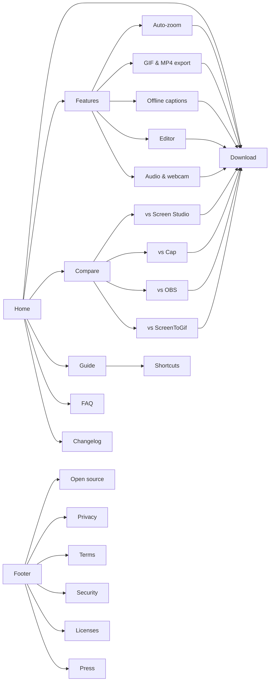

# 06, Page specs

24 routes. Every route is reachable from the footer sitemap; primary ones from the header.

## Global chrome

**Header** (all pages): logo mark + "Vuoom" left; center links `Features` `Compare` `Guide`
`Changelog`; right: GitHub star button (live count, falls back to "Star") and **Download**
(red record light + "Download", the only red fill on the page). 72px, compacts to 56px after
80vh. Below 960px: logo, Download, menu button; menu is a full-height sheet with the links at
`--step-3`, focus-trapped, `lenis.stop()`. Skip link "Skip to content" first in tab order.

**Footer** (all pages): curtain reveal. Row 1: closing line + Download. Row 2: 5 sitemap
columns (Product, Compare, Help, Project, Legal). Row 3: oversized `VUOOM●` wordmark (step-6,
bleeds to edges). Row 4: "© 2026 Vuoom contributors. Apache-2.0." + version + "Made on
Windows, for Windows."

**Breadcrumbs** on every page below home, visible, with `BreadcrumbList` JSON-LD.

## 1. `/` Home (Motion M01 to M18)

| # | Section | Purpose | Layout | Mobile |
|---|---|---|---|---|
| 1 | Hero | What it is + the signature | Slate strip; h1 left 5 cols over stage 7 cols bleeding right; lead; CTA row (Download for Windows, Star on GitHub); meta line "Windows 10 & 11 · 8 MB installer · Apache-2.0" ; keycaps `Ctrl Shift Z` under stage | Stack: slate, h1, lead, CTA, stage full-width, meta |
| 2 | The problem (pinned) | Make the pain concrete | Full viewport pinned, numbers at step-5 left, screenshot box right | Not pinned below 640px; three stacked frames instead |
| 3 | Before / after | Proof on the same take | Full-bleed wipe, labels "Flat recording" / "Vuoom" in mono slates, keyboard slider | Same, handle 44px |
| 4 | How it works | Three verbs | Oversized numerals 01 02 03 with Record / Edit / Export, each a real screenshot crop; hairline rules | Stacked |
| 5 | Editor (pinned) | The editor is real | Pinned editor rebuild, captions left | Not pinned; static completed timeline + 4 captions |
| 6 | Feature index | Everything, scannable | 9 numbered rows, hairlines, hover opens media + 2-line detail and a link to the feature page | Rows always open (no hover) |
| 7 | Export | Small files, on purpose | Export screenshot left, the statement "Fits under 10 MB, on purpose." right, list of formats | Stacked |
| 8 | Principles | Trust | Three type-as-graphic statements: "No account." "No watermark." "No cloud." with one-line proofs; open-source strip (stars, license, Rust + Tauri, "not Electron") | Stacked |
| 9 | Compare strip | Answer "why not X" | 4-row table: Vuoom, Screen Studio, Cap, OBS; link to /compare/ | Horizontal scroll table with sticky first column |
| 10 | FAQ | Objections | 6 `
` | same |
| 11 | Final CTA | Close | step-5 line + Download | same |

LCP element: the hero h1 (text), so LCP does not wait on the screenshot. Stage image is
`fetchpriority=high` but not LCP-critical.

## 2. `/download/`

Big Download (.exe, size from the release), secondary .msi, "All releases" link, system
requirements, SmartScreen explainer with steps, SHA/signature note, "What's new in vX" pulled
from the release body (build time), install/uninstall steps, winget/scoop: "not yet" (honest).
Client script refreshes version/size from the GitHub API; if the API fails, links point to
`releases/latest`. `SoftwareApplication` JSON-LD with `downloadUrl`, `fileSize`,
`softwareVersion`, `operatingSystem`, `offers.price 0`.

## 3. `/features/` hub + 5 feature pages

Hub: h1, lead, the 5 feature pages as index rows (same component as home §6), then the rest of
the features as a compact list.

Feature page template (`/features/auto-zoom/`, `/features/gif-export/`,
`/features/captions/`, `/features/editor/`, `/features/audio-and-webcam/`):
1. Hero: slate + h1 (keyword) + lead + Download + screenshot or stage
2. "How it works" 3 to 5 steps with keycaps where relevant
3. Details: 4 to 6 short h3 blocks
4. Relevant shortcuts table
5. FAQ, 3 to 5 questions (FAQPage JSON-LD)
6. Related features (2 rows) + CTA

## 4. `/compare/` hub + 4 pages

Hub: honest table (platform, price, open source licence, auto-zoom, GIF export, offline
captions, account required, installer size) for Vuoom, Screen Studio, Cap, OBS, ScreenToGif,
FocuSee. "Checked September 2026" stamp and a "spotted a mistake? open an issue" link.

Compare page template (`/compare/screen-studio/`, `/compare/cap/`, `/compare/obs/`,
`/compare/screentogif/`): h1 "Vuoom vs X", 2-line verdict, "Choose X if…" / "Choose Vuoom
if…" (fair to the competitor, which is what ranks and what builds trust), the table rows for
those two, migration notes, FAQ, CTA.

## 5. Help

- `/guide/`: sticky table of contents (desktop left rail), sections: Install, First recording, Zooms, Editing, Annotations, Audio & webcam, Captions, Export, Projects & recovery, Troubleshooting. `HowTo` JSON-LD for the first recording
- `/shortcuts/`: full shortcut table, printable, keycaps
- `/faq/`: 14 questions in 4 groups, FAQPage JSON-LD
- `/changelog/`: releases from the GitHub API at build time, newest first, each with date, version anchor, rendered notes; link to GitHub for older

## 6. Project and legal

- `/open-source/`: licence, architecture diagram (from README), crates list, how to build, how to contribute, credits
- `/privacy/`, `/terms/`, `/security/`, `/licenses/` (third-party + font OFL), `/press/` (logo downloads, screenshots, boilerplate at 25/50/100 words, colours, fonts)
- `/404`: "Cut." as a timeline cut block, links home and to the guide

## States

- GitHub API unavailable or rate-limited: star count hides, version shows the build-time value
- JS disabled: all content readable, no pins, before/after shows both images side by side, countdown never shows
- Reduced motion: see 05, every section static and complete
